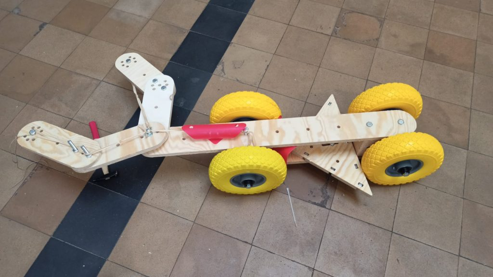

# Mekanos géants

Inspiré du jeu de construction en métal, et inspiré par le projet de [Cultureghem](https://cultureghem.be), le Fablab'ke vous propose les fichiers source afin de réaliser vos propres meccanos géants en bois.

Le principe de base est d'utiliser un espacement de 100 mm entre les perçages, les batons font 100 mm de large et ont une longueur variable enfonction du nombre de trous.

Les assemblages se font entièrement avec des vis papillon et boulons M10.

Nous utilisons du multiplex sapin de 18 mm fraisé à la cnc.

Les équerres ont été commandées chez un fournisseur qui fait de la découpe laser sur métal. Nous avons utilisé de la tole galvanisée en 1.5 mm.

Contenu des dossiers : 

- [/adaptateur](adaptateur) adaptateur en impression 3d pour roues pleines (voir photos)
- [/batons](batons) contient tous les dxf pour fraisage des batons
- [/equerres](equerres) contient les fichiers nécessaires à la commande d'équerres metal 

